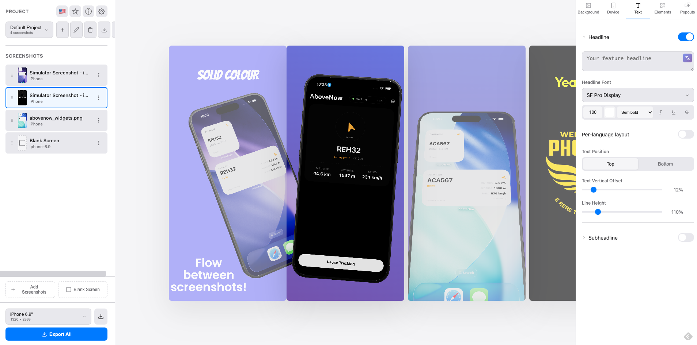

# App Store Screenshot Generator

A free, open-source tool for creating App Store marketing screenshots — customizable
backgrounds, text overlays, and 2D or 3D device mockups. It runs entirely in the
browser: no build step, no backend, no account, and your screenshots never leave your
machine.

**[Start using it now →](https://cosmo-nz.github.io/appscreen/)** — hosted on GitHub Pages,
nothing to install.



<sub>Device continuation in action: the tilted iPhone belongs to the first slide and carries
across the seam into the second, where it renders *behind* that slide's own device.</sub>

[](LICENSE)

> 🍋 **Originally built by [YuzuHub](https://yuzuhub.com)** — vibe coded by
> [Stefan](https://github.com/BlackMac) in Düsseldorf, Germany. The upstream project
> lives at [YUZU-Hub/appscreen](https://github.com/YUZU-Hub/appscreen) and is hosted at
> [yuzu-hub.github.io/appscreen](https://yuzu-hub.github.io/appscreen/). Everything below
> is built on that work.

This repository is a standalone fork focused on the 3D device mockups and on running the
tool as a plain static site you can host anywhere.

## What's new in this release

This fork adds one significant feature, several correctness and performance fixes to the
rendering pipeline, and a substantial simplification of how the project is packaged.

### Device continuation

A device can now bleed off the edge of one slide and continue onto the next, so a pair of
screenshots reads as one continuous scene across the App Store carousel — as in the
screenshot at the top of this README.

Turn it on per slide in the **Device** tab under *Continuation*: **Continue from previous
slide** and **Continue from next slide** can be enabled independently, and each direction
has its own **Behind / In Front** control deciding whether the neighbour's device draws
behind or in front of this slide's own device.

Nothing is copied between slides. A continuation is derived at render time from the
neighbouring screenshot, so reordering, restyling or replacing a slide updates its
neighbours automatically. It works in both 2D and 3D — the 3D path uses an off-axis
camera frustum (`camera.setViewOffset`) to render the correct tile of a wider virtual
frame rather than moving the model, so perspective stays consistent across the seam.

Design notes and the implementation plan are in [`docs/superpowers/`](docs/superpowers/).

### Rendering fixes

- **One render path.** The main preview, the side-preview carousel and the exported PNG
  now all go through a single `renderScreenshotToCanvas()`. They previously used
  separate, drifted copies of the drawing code — noise, for one, rendered at a visibly
  different intensity in the export than in the preview. Roughly 410 lines of duplicated
  pipeline were deleted.
- **No more white outline on 3D devices.** The device edge rendered as a bright hairline,
  sometimes dashed. Two independent causes: highlight clipping on the phone body (fixed
  with ACES filmic tone mapping) and aliasing along the silhouette (fixed by enabling
  MSAA).
- **3D screen overlay calibrated to the model.** The screen image is composited onto a
  plane over the 3D model's aperture, and that plane was sized by a single rough factor.
  It is now calibrated per axis, with its own corner radius and a sub-pixel vertical
  nudge, so bezels are even on all four sides instead of overshooting top and bottom.
- **Duplicating a screenshot keeps everything.** Overlay elements, popouts and the
  background image were silently dropped by *Duplicate*; they are now deep-copied with
  fresh IDs.
- **The translate dialog respects the source language.** Two elements shared a DOM id, so
  the dialog read the wrong one and always translated from the default language.

### Performance

`updateCanvas()` re-rendered both side previews and wrote the whole project to IndexedDB
on every single state change — so every frame of a slider drag. Side-preview renders and
saves are now coalesced, with explicit flushes on project switch, tab hide and page
unload so nothing is lost. Measured on the worst-case slide during that work: ~412 ms
down to ~80 ms, 13 WebGL renders down to 3, and ~30 saves per drag down to 1.

### Web-only, no external dependencies

The project used to also ship as a Tauri desktop app and a Docker image. Both are gone,
along with their build workflows — what remains is a static site.

Every third-party library is vendored in [`vendor/`](vendor/) and all 1,295 Lucide icons
are bundled in `lucide-svgs.js` rather than fetched from a CDN. The only external request
the app makes at runtime is to Google Fonts, for the font picker — plus, if you choose to
use it, your AI provider for translation. Serve the directory and it works offline
otherwise.

A `LICENSE` file was also added: MIT, with YuzuHub's copyright preserved, plus attribution
for the CC BY 4.0 3D models and the other bundled libraries.

## Features

### Output & Export
- **Multiple Output Sizes**: iPhone 6.9", 6.7", 6.5", 5.5" and iPad 12.9", 11" App Store requirements, plus custom sizes
- **Batch Export**: Export all screenshots at once as a ZIP file
- **Per-Screenshot Settings**: Each screenshot can have its own background, device settings, and text

### Backgrounds
- **Gradient Backgrounds**: Multi-stop gradients with draggable color stops and angle control
- **Preset Gradients**: Quick-access gradient presets for common styles
- **Solid Color**: Simple single-color backgrounds
- **Image Backgrounds**: Upload custom images with blur, overlay, and fit options
- **Noise Overlay**: Add subtle noise texture to any background

### Device Mockups
- **2D Mode**: Position, scale, rotate, and adjust corner radius of screenshots
- **3D Mode**: Interactive iPhone 15 Pro Max and Samsung Galaxy S25 Ultra mockups with drag-to-rotate
- **Continuation**: Let a device bleed across the seam into the adjacent slide, in either direction, in front of or behind the local device
- **Position Presets**: Centered, bleed, tilt left/right, perspective, and more
- **Shadow Effects**: Customizable drop shadows with color, blur, opacity, and offset
- **Border Effects**: Add borders around screenshots with adjustable width and opacity

### Text Overlays
- **Headlines & Subheadlines**: Separate controls with enable/disable toggles
- **Font Picker**: Access to 1500+ Google Fonts with search and preview
- **Text Styling**: Font weight, italic, underline, strikethrough options
- **Positioning**: Top, center, or bottom placement with offset control
- **Line Height**: Adjustable spacing for multi-line text

### Multi-Language Support
- **Multiple Languages**: Add translations for any language
- **Language Flags**: Visual language switcher with flag icons
- **AI-Powered Translation**: Auto-translate using Claude, OpenAI, or Google AI
- **Per-Screenshot Languages**: Different text per screenshot if needed
- **Localized Screenshots**: Upload language-specific screenshot images with auto-detection from filename
- **Smart Duplicate Detection**: Dialog to replace, create new, or skip when uploading matching screenshots
- **Multi-Language Export**: Export current language only or all languages in separate folders

### Project Management
- **Multiple Projects**: Create, rename, and delete projects
- **Auto-Save**: All changes saved automatically to browser storage
- **Screenshot Count**: See screenshot counts in project selector

### User Interface
- **Dark Theme**: Easy on the eyes for extended editing sessions
- **Side Preview Carousel**: See adjacent screenshots while editing
- **Drag & Drop**: Reorder screenshots by dragging
- **Collapsible Sections**: Clean UI with expandable settings panels
- **Tab Persistence**: Remembers your active tab between sessions

## Running it

The app uses IndexedDB for persistence, so it has to be served over HTTP. Opening
`index.html` straight from the filesystem will load but will not save your work.

```bash
python3 -m http.server 8000
```

Then open `http://localhost:8000`. `npx serve .`, VS Code's Live Server extension, or any
other static file server work equally well.

### Hosting it

There is no build step — upload the repository contents to any static host. To publish
this fork on GitHub Pages, enable Pages for the repository (Settings → Pages → deploy from
the `main` branch, root folder).

### With Claude Code

The repository includes a [`CLAUDE.md`](CLAUDE.md) describing the architecture, the render
pipeline and the project conventions. Open the folder in Claude Code and say *"start the
app"* — it will bring up the server and tell you where to point your browser.

## Usage

1. **Upload Screenshots**: Drag and drop your app screenshots or click to browse
2. **Choose Output Size**: Select the target device size from the sidebar
3. **Customize Background**: Choose gradient, solid color, or image background
4. **Position Screenshot**: Use presets or manually adjust scale, position, and rotation
5. **Switch to 3D** (optional): Enable 3D mode for an interactive device mockup
6. **Link Slides** (optional): Enable continuation to run one device across two slides
7. **Add Text**: Enter your headline and optional subheadline
8. **Export**: Download the current screenshot or export all at once as ZIP

## AI Translation

To use the AI-powered translation feature:

1. Click the Settings icon (gear) in the sidebar
2. Choose your AI provider (Claude, OpenAI, or Google)
3. Enter your API key from the respective provider's console
4. Add multiple languages to your headline/subheadline
5. Click the translate icon and use "Auto-translate with AI"

Your API key is stored locally in your browser and only sent to the respective AI
provider's API.

## Tech Stack

- Vanilla JavaScript, no frameworks and no build process
- HTML5 Canvas for 2D rendering
- Three.js (r128) + GLTFLoader for 3D device mockups — vendored in `vendor/`
- JSZip for batch export — vendored in `vendor/`
- Lucide icons — bundled as SVG in `lucide-svgs.js`
- IndexedDB for local storage
- Google Fonts for the font picker (the only external runtime dependency)
- Claude / OpenAI / Google APIs for translations, if you supply a key

### Project layout

| Path | Purpose |
|------|---------|
| `index.html` | UI structure and all modals |
| `app.js` | Application logic, state, and the canvas render pipeline |
| `three-renderer.js` | Three.js scene, device configs, and 3D rendering |
| `language-utils.js` | Language detection, localized images, translation dialogs |
| `vendor/` | Vendored third-party libraries |
| `models/` | GLB device models |
| `tests/render-baseline.js` | Deterministic render-baseline harness (see below) |
| `docs/superpowers/` | Design spec and implementation plan for device continuation |

### Render-baseline harness

Because the whole app is a rendering pipeline, `tests/render-baseline.js` hashes the
canvas output of ten fixtures so pipeline refactors can be proven pixel-identical. It is
not loaded by `index.html`. In the DevTools console:

```javascript
await import('/tests/render-baseline.js');
await renderBaseline.capture();   // before your change
// edit code, reload the page
await renderBaseline.compare();   // after your change
```

It seeds `Math.random` for the noise texture, stubs `saveState` so fixtures never touch
your real projects, and restores your project state when it finishes.

## Apps Using This Project

Carried over from upstream — built something with this tool? Add your app by submitting a
pull request.

| App | Description | Link |
|-----|-------------|------|
| Cable | Manage your 12V systems like Boats and RVs | [cable.yuzuhub.com](https://cable.yuzuhub.com) |
| Eno | Wine pairings and food pairings made easy | [eno.yuzuhub.com](https://eno.yuzuhub.com) |
| TravelRates Currency Converter | Exchange Rates for Travelers | [apple.com](https://apps.apple.com/sg/app/travelrates-currency-converter/id6756080378) |
| Trakz Sales Tracker | Manage sales for restaurants and small businesses | [apple.com](https://apps.apple.com/us/app/trakz-sales-tracker/id6748954468) |
| AI Soccer Insights Football IQ | AI-powered football predictions and insights | [apple.com](https://apps.apple.com/us/app/ai-soccer-insights-football-iq/id6592649804) |
| Navegatime | Time tracking for workers and business functions | [play.google.com](https://play.google.com/store/apps/details?id=com.companyname.NavegaTime) |
| Sommo | Your personal wine journey — scan labels, learn wine, and build your tasting journal | [sommo.app](https://sommo.app) |
| Dandelion: Write and Let Go | An ephemeral journal for writing to let go, not save | [apple.com](https://apps.apple.com/us/app/dandelion-write-and-let-go/id6757363901) |
| *Your app here* | *Submit a PR to add your app* | *Your app link* |

## License

MIT — see [LICENSE](LICENSE). Copyright remains with YuzuHub, who wrote the original.

The bundled 3D models are **not** MIT and carry their own attribution requirement:

- **iPhone 15 Pro Max 3D Model** by [MajdyModels](https://sketchfab.com/majdymodels) — licensed under [CC BY 4.0](https://creativecommons.org/licenses/by/4.0/)
- **Samsung Galaxy S25 Ultra 3D Model** by [mistJS](https://sketchfab.com/mistjs) — licensed under [CC BY 4.0](https://creativecommons.org/licenses/by/4.0/)

CC BY 4.0 requires that this attribution travels with the models wherever you redistribute
them. The full third-party breakdown, including three.js, JSZip and Lucide, is in
[LICENSE](LICENSE).

## Credits

Original project by [Stefan](https://github.com/BlackMac) at
[YuzuHub](https://yuzuhub.com/en) — building smart AI products from Düsseldorf, Germany.
Check out [yuzu.chat](https://yuzu.chat), [Eno](https://eno.yuzuhub.com) and
[VoltPlan](https://voltplan.app).

This fork is maintained by [Cosmo-NZ](https://github.com/Cosmo-NZ).
